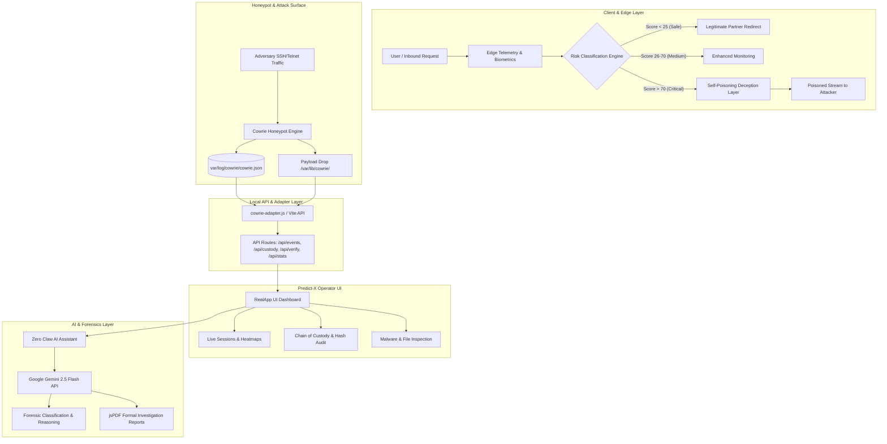

# 🛡️ PREDICT-X

<div align="center">


**Autonomous Fraud & Phishing Defense Framework with Edge-First Architecture, Honeypot Deception & AI Forensics**

[](https://navinadithya.github.io/Predict-X/)
[](https://react.dev/)
[](https://vitejs.dev/)
[](https://ai.google.dev/)
[](https://github.com/cowrie/cowrie)
[](https://github.com/parallax/jsPDF)
[](LICENSE)
[](https://github.com/NavinAdithya/Predict-X/pulls)

🌐 **Live Application:** [https://navinadithya.github.io/Predict-X/](https://navinadithya.github.io/Predict-X/)

[Key Capabilities](#-key-capabilities) •
[Architecture](#-system-architecture) •
[Demo Walkthrough](#-interactive-demo--testing-guide) •
[Getting Started](#-getting-started) •
[Deployment](#-deployment) •
[Cowrie Integration](#-cowrie-honeypot-integration) •
[Project Structure](#-project-structure)

</div>

---

## 📌 Executive Summary

**PREDICT-X** is an enterprise-grade, edge-first cybersecurity and anti-fraud platform designed to autonomously detect, classify, deceive, and neutralize adversarial activity in real time. 

By combining **edge behavioral biometrics**, **adaptive honeypot deception layers**, **cryptographic chain of custody verification**, and **Google Gemini AI-driven SOC copilot intelligence**, PREDICT-X delivers high-resilience fraud prevention that continues operating even during complete cloud infrastructure outages.

---

## ⚡ Key Capabilities

### 1. 🛡️ Edge-First Behavioral Risk Engine
* **Real-time Scoring (0–100)**: Evaluates typing anomalies, impossible travel, behavioral fingerprinting, and session telemetry at the client edge with sub-millisecond overhead.
* **Granular Risk Tiers**: Categorizes traffic dynamically into **SAFE** (0–25), **MEDIUM** (26–70), and **HIGH RISK / CRITICAL** (71–100).
* **Safe User Pass-Through**: Verifies legitimate users and routes them securely to authenticated destinations (e.g. AWS Academy, Kyndryl portals) with telemetry retention.

### 2. 🌀 Autonomous Deception & Self-Poisoning
* **Adversarial Neutralization**: When a high-risk session is identified, the system activates automated *Self-Poisoning*.
* **Synthetic Noise Injection**: Injects corrupt, hallucinated behavioral and biometric streams directly back into the attacker's session, polluting automated credential-stuffing tools and scraping botnets.
* **Live Poison Stream Telemetry**: Security operators can inspect the corrupted payload stream in real time.

### 3. 🍯 Cowrie Honeypot Intelligence Adapter
* **Built-in Log Adapter (`cowrie-adapter.js`)**: Parses live SSH and Telnet intrusion sessions directly from Cowrie honeypot event logs (`var/log/cowrie/cowrie.json`).
* **Keystroke & Command Playback**: Reconstructs attacker command-line history, session durations, brute-force credentials, and client fingerprints.
* **Malware Artifact Extraction**: Automatically inventories dropped payload binaries and scripts with direct hash analysis.

### 4. 🤖 Zero Claw AI Copilot (Powered by Gemini 2.5 Flash)
* **Automated Log Classification**: Assesses threat severity, confidence scores, and plain-English risk rationale on incoming event logs.
* **Decision Auditing & Explainability (XAI)**: Generates detailed explanations for risk scoring decisions for compliance and SOC review.
* **Interactive Threat Chat**: Context-aware AI security assistant that queries live platform telemetry to answer investigator inquiries.

### 5. 🔐 Cryptographic Chain of Custody & Evidence Locker
* **SHA-256 Evidence Hashing**: Every security event, payload, and log snapshot is cryptographically stamped with SHA-256 hashes.
* **Tamper Verification**: Instant cryptographic verification modal to confirm forensic integrity against deliberate tampering.
* **Malware Storage**: Secure catalog of captured binary downloads (e.g. `botnet.sh`) with metadata extraction.

### 6. 📄 ISO/IEC 27037 Forensic PDF Generator
* **Court-Ready PDF Reports**: Generates formal 10-section forensic investigation reports with administrative metadata, executive summary, tool specifications, exhibits, and chain of custody logs using `jsPDF`.

### 7. 🌐 Offline Resilience & Cloud Outage Simulator
* **Edge Queue Management**: Seamlessly falls back to local edge buffering during cloud outages (e.g., AWS service disruptions).
* **Automatic Cloud Sync**: Telemetry stored locally in edge queues is automatically reconciled and synchronized once cloud connectivity is restored.

---

## 🏛️ System Architecture



---

## 🎮 Interactive Demo & Testing Guide

Predict-X includes two operational simulation personas:

### 1. 🛡️ Administrator Console
To access the complete administrative command center:
1. Open the [Live Web App](https://navinadithya.github.io/Predict-X/) or run locally with `npm run dev`.
2. Select **Administrator** role.
3. Login using `admin@predictx.io` (any password).
4. Access the full navigation suite:
   - **Overview**: High-level KPI metrics, real-time threat activity, and attack breakdown.
   - **Fraud Defense**: Live session feed, safe redirects table, high-risk alerts with live poison stream, and cloud outage simulator.
   - **Honeypot**: Detailed Cowrie telemetry, terminal keystroke reconstruction, and attacker profiles.
   - **Logs Feed**: Live streaming Cowrie event monitor.
   - **Custody**: Immutable cryptographic SHA-256 evidence chain with instant verification.
   - **Files**: Inspect captured binaries and downloaded malware artifacts.
   - **API Health**: Monitor server endpoints and backend adapter status.
   - **Zero Claw AI**: Conversational SOC copilot for threat triage and automated PDF report generation.

### 2. 👤 End-User Client Simulation
To test the real-time edge risk classification and self-poisoning engine:
1. Select **End User** role on the login screen.
2. Test different email formats to observe autonomous classification:

| Scenario | Test Email Pattern | Classification | Result & System Action |
| :--- | :--- | :--- | :--- |
| **Legitimate User** | `safe1@company.com`<br>`user_a@company.com` | **SAFE** (Score: ~12-19) | Behavioral fingerprint captured → Instant redirect to partner portal |
| **High-Risk Adversary** | `critical@company.com`<br>`attacker@hacker.com` | **CRITICAL** (Score: 97) | Admin alert dispatched → **Self-Poisoning ACTIVE** (corrupted biometrics fed to client) |
| **Unknown / Neutral** | `employee@domain.com` | **MEDIUM** (Score: ~45) | Enhanced behavioral tracking & telemetry capture |

---

## 🚀 Getting Started

### Prerequisites
- **Node.js**: `v18.0.0` or higher
- **npm**: `v9.0.0` or higher
- (Optional) **Google Gemini API Key**: For Zero Claw AI analysis & automated forensic reports.

### Local Installation

1. **Clone the repository:**
   ```bash
   git clone https://github.com/NavinAdithya/Predict-X.git
   cd Predict-X
   ```

2. **Install dependencies:**
   ```bash
   npm install
   ```

3. **Configure Environment Variables:**
   Copy the `.env.example` file to `.env`:
   ```bash
   cp .env.example .env
   ```
   Add your Gemini API Key in `.env`:
   ```env
   VITE_GEMINI_API_KEY=your_google_gemini_api_key_here
   ```

4. **Launch Development Server:**
   ```bash
   npm run dev
   ```
   Open your browser at `http://localhost:5173` to explore the dashboard.

5. **Build for Production:**
   ```bash
   npm run build
   ```
   The compiled assets will be generated in the `dist/` directory.

---

## 🚀 Deployment

### GitHub Pages (Automated CI/CD)

The repository includes a automated GitHub Actions workflow (`.github/workflows/deploy.yml`) that builds and deploys the application directly to GitHub Pages on every push to `main`.

**To activate GitHub Pages on the repo:**
1. Navigate to **Settings** → **Pages** in the [Predict-X repository](https://github.com/NavinAdithya/Predict-X/settings/pages).
2. Under **Build and deployment** → **Source**, select **GitHub Actions**.
3. (Optional) Under **Settings** → **Secrets and variables** → **Actions**, add a repository secret named `VITE_GEMINI_API_KEY` to enable live AI features in the cloud build.

Once active, the application is live at:
👉 **[https://navinadithya.github.io/Predict-X/](https://navinadithya.github.io/Predict-X/)**

---

## 🍯 Cowrie Honeypot Integration

Predict-X ships with a built-in telemetry adapter (`cowrie-adapter.js`) that plugs directly into [Cowrie SSH/Telnet honeypots](https://github.com/cowrie/cowrie).

### Supported Endpoints
The embedded Vite plugin serves the following REST endpoints:
- `GET /api/health` — Honeypot ingestion service health and path checks.
- `GET /api/stats` — Aggregate metrics: total sessions, unique attacker IPs, credential attempts, and malware downloads.
- `GET /api/events` — Paginated Cowrie JSON log entries with filtering by IP and event type.
- `GET /api/custody` — Cryptographically hashed evidence records (SHA-256).
- `GET /api/verify?hash=<sha256>` — Live hash verification against local evidence store.
- `GET /api/files` — Listing of captured download binaries stored in the evidence vault.

---

## 📁 Project Structure

```text
Predict-X/
├── .github/workflows/deploy.yml # GitHub Actions automated CI/CD deployment
├── cowrie-adapter.js          # Express/Vite API adapter for Cowrie honeypot logs
├── index.html                 # HTML application entry point
├── package.json               # Node.js dependencies and script definitions
├── vite.config.js             # Vite configuration with embedded Cowrie API plugin
├── .env.example               # Template environment configuration
├── .gitignore                 # Git ignore rules for node_modules, dist, and secrets
├── public/                    # Static public assets
├── var/                       # Honeypot sample data and artifacts
│   ├── lib/cowrie/downloads/  # Dropped malware binaries (e.g. botnet.sh)
│   └── log/cowrie/            # Cowrie JSON and text session logs
└── src/
    ├── main.jsx               # React DOM entry point
    ├── App.jsx                # Application root routing
    ├── RealApp.jsx            # Master state container & authentication router
    ├── index.css              # Cyber-themed global design system and styling
    ├── components/
    │   ├── ApiHealthStatus.jsx        # API & backend telemetry diagnostics
    │   ├── ChainOfCustody.jsx         # SHA-256 evidence chain & verification modal
    │   ├── DemoControls.jsx           # Quick scenario simulation triggers
    │   ├── ForensicReportGenerator.jsx# Automated ISO 27037 PDF report compiler
    │   ├── FraudDefenseDashboard.jsx  # Main fraud defense tab navigator
    │   ├── HighRiskAlerts.jsx         # Live poison stream & critical alerts
    │   ├── HoneypotDetails.jsx        # Attack terminal replay & IP intelligence
    │   ├── HoneypotMonitor.jsx        # Real-time Cowrie log visualizer
    │   ├── HoneypotOverview.jsx       # SOC summary metrics & threat indicators
    │   ├── LiveSessions.jsx           # Active session radar & risk telemetry
    │   ├── ResilienceStatus.jsx       # AWS outage simulator & edge queue sync
    │   ├── S3Storage.jsx              # Dropped binary artifact & malware browser
    │   ├── SafeUserRedirects.jsx      # Legitimate traffic pass-through audit
    │   ├── UserDashboard.jsx          # End-user classification & simulation UI
    │   └── ZeroClawChat.jsx           # Gemini-powered conversational AI SOC copilot
    └── services/
        ├── honeypotApi.js             # Client for /api/* Cowrie endpoints with static fallback
        ├── predictXData.js            # In-memory edge fraud & resilience store
        └── zeroClawApi.js             # Google Gemini 2.5 Flash & jsPDF service
```

---

## 📜 License

This project is distributed under the **MIT License**. See [`LICENSE`](LICENSE) for details.

---

<div align="center">
Developed with 💚 for Next-Generation Cybersecurity & Fraud Defense
</div>
